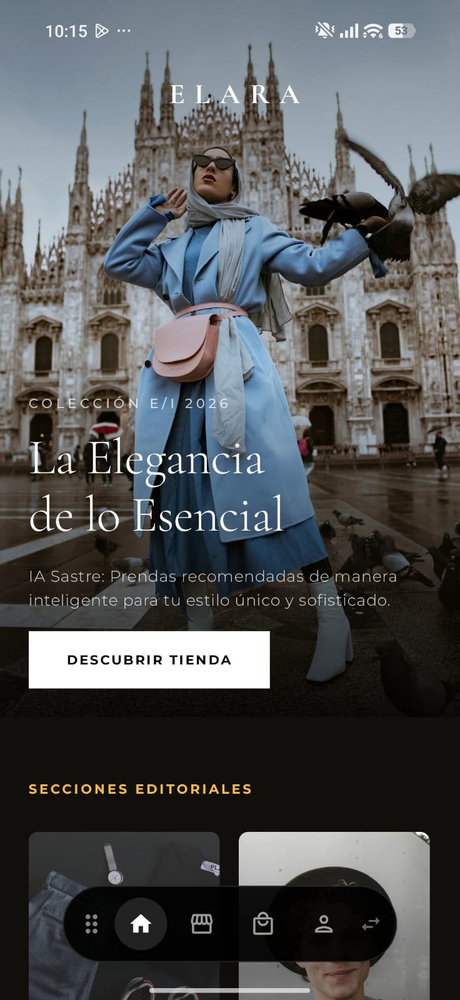
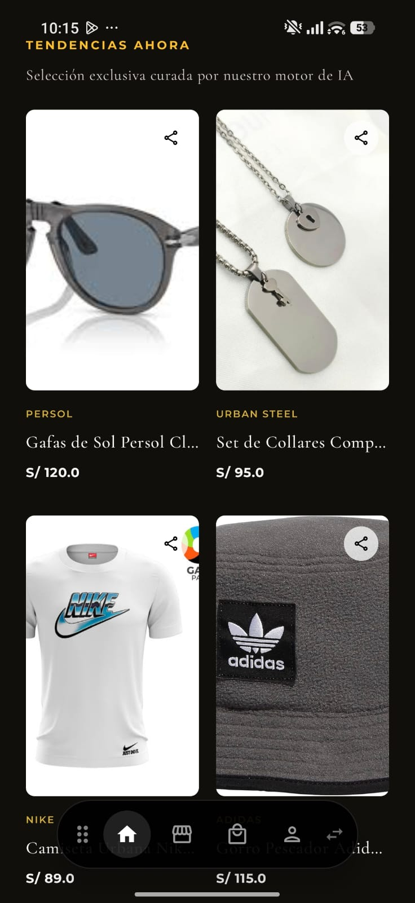
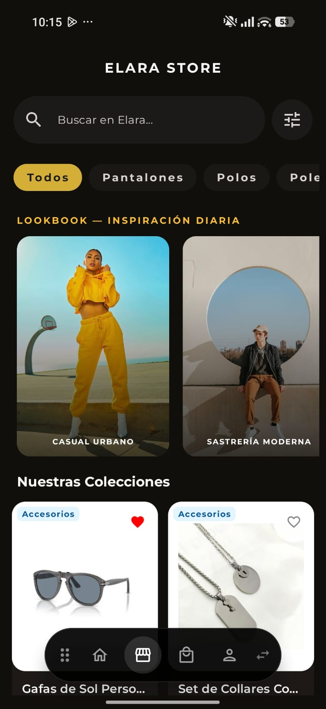
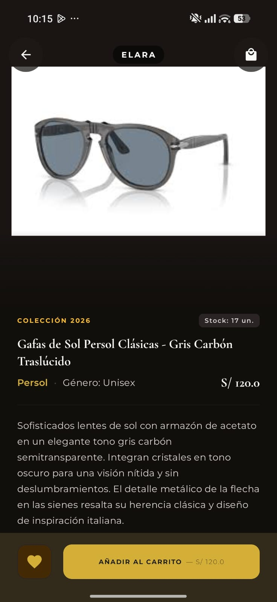
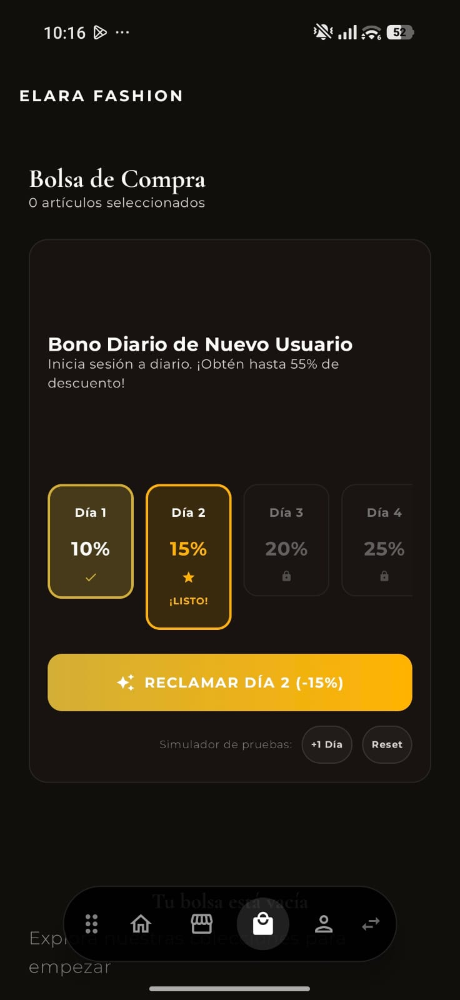
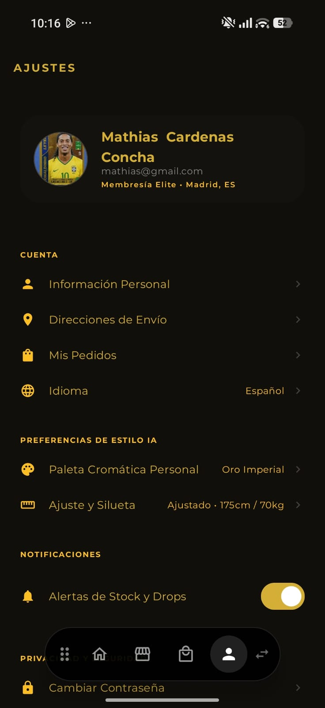
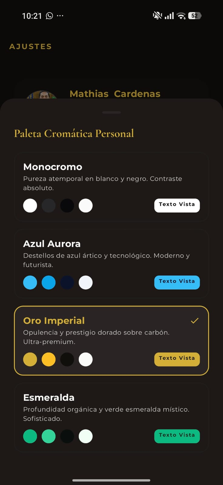

# Elara AI Fashion - Asesoría de Moda Inteligente y E-Commerce

## Integrantes del Grupo
1. Ruberth Edgardo Tapara Hayqui
2. Adriel Totora Vilca
3. Mathias Cardenas Concha

---

## 1. Descripción del Proyecto
Elara AI Fashion es una aplicación móvil que combina el comercio electrónico de moda con un asesor de imagen personal interactivo. La aplicación está diseñada para resolver la clásica pregunta de cómo combinar prendas de vestir, proporcionando al usuario recomendaciones personalizadas basadas en Inteligencia Artificial en tiempo real. 

El usuario puede explorar el catálogo de ropa y calzado, interactuar con el asesor de moda escaneando su atuendo con la cámara del celular, y recibir sugerencias directas de accesorios que combinen de forma ideal según su estilo y género.

---

## 2. Características y Funciones Principales
- Catálogo interactivo: Búsqueda y filtrado de prendas de vestir y calzado por categoría.
- Asesor de moda inteligente: Recomendación en tiempo real utilizando la cámara nativa.
- Armario virtual offline: Guardado local de prendas preferidas para acceso sin internet.
- Carrito de compras: Gestión de bolsa, cálculo de montos y cupones de descuento.
- Sistema de gamificación: Recompensa de descuento diario para usuarios recurrentes.
- Panel de ajustes personalizado: Administración de datos de perfil, direcciones y selección de temas cromáticos dinámicos.

---

## 3. Arquitectura y Stack Tecnológico
La aplicación se desarrolla bajo el patrón de arquitectura MVVM (Model-View-ViewModel) para asegurar un desarrollo modular e independiente:
- Interfaz de Usuario: Jetpack Compose y componentes de Material 3 para pantallas adaptativas y dinámicas.
- Motor de IA: SDK de Google Generative AI (Gemini 3.5 Flash) para el análisis de estilo y combinación de prendas.
- Base de Datos Remota: Firebase Cloud Firestore para sincronización de pedidos e inventario.
- Autenticación: Firebase Authentication para el registro e inicio de sesión persistente de usuarios.
- Base de Datos Local: Room SQLite para la persistencia offline del armario virtual.
- Red y API: Retrofit con Serialización KotlinX para el consumo de servicios web.
- Multimedia: CameraX para el manejo nativo de la cámara del dispositivo móvil.
- Carga de imágenes: Coil 3 para el renderizado eficiente de URL de fotos.

---

## 4. Recorrido Visual de la Aplicación

A continuación se presenta el flujo visual de Elara AI Fashion con las capturas de pantalla de la interfaz de usuario:

### Pantalla de Carga 


Esta es la pantalla de presentación que nos muestra la aplicación apenas la abrimos. Nos ayuda a validar de forma automática si el usuario ya inició sesión anteriormente para no tener que pedirle sus datos de nuevo, mandándolo directo al inicio si todo está en orden.

### Pantalla de Inicio


En esta sección nos muestra la bienvenida a la tienda con una estética limpia. Nos ayuda a navegar de manera sencilla gracias a la barra flotante que pusimos abajo y tiene un botón directo para ir a ver todas las prendas.

### Galería de Tendencias 


Aquí la app nos muestra un carrusel dinámico con la ropa que está en tendencia. Nos permite ver fotos reales, precios y marcas de manera interactiva sin saturar la pantalla.

### Catálogo de la Tienda 


Esta pantalla nos muestra toda la variedad de ropa que tenemos disponible. Nos ayuda a filtrar por categorías (como polos, pantalones, calzado, etc.) usando los botones de arriba, y también tiene un buscador para encontrar cosas rápido.

### Detalle de Producto 


Aquí nos muestra la información completa de la prenda que seleccionamos. Nos ayuda a ver el stock disponible, agregarlo al carrito de compras, o guardarlo en nuestros favoritos si nos gustó.

### Cámara del Asesor de Moda 


Esta es la parte clave del proyecto. Nos permite usar la cámara para tomarle una foto a nuestro outfit y, con la ayuda de la inteligencia artificial de Gemini, nos da consejos de qué accesorio de la tienda combina mejor con lo que llevamos puesto.

### Bolsa de Compra y Beneficio Diario 


En esta parte nos muestra los productos que hemos agregado para comprar. También nos ayuda a reclamar un descuento diario a través de un juego de asistencia diaria para simular compras más baratas.

### Ajustes del Perfil 


Esta pantalla nos muestra todas las opciones para configurar nuestra cuenta. Nos ayuda a cambiar nuestros datos, ver la dirección de envío, configurar el idioma de la app y cerrar sesión cuando queramos.

### Selección de Paleta Cromática 


Aquí nos muestra un selector flotante de colores. Nos permite cambiar el diseño visual de toda la aplicación al instante, eligiendo entre varios estilos como Oro Imperial o Esmeralda.

### Editor de Información Personal 


Esta ventana nos ayuda a editar de manera rápida nuestro nombre, apellido y teléfono. Guarda los cambios de forma segura en la base de datos para que se actualice en todo nuestro perfil.

---

## 5. Funcionamiento de la Inteligencia Artificial 
El módulo de recomendación se conecta mediante peticiones seguras de red con el modelo de Gemini. La app envía la captura de imagen tomada por el usuario junto a un prompt estructurado que contiene los detalles de la prenda y el género del usuario. Gemini procesa esta información y devuelve en pocos segundos las mejores alternativas del catálogo que armonicen en color, estilo y tipo de producto.

---

## 6. Configuración e Instalación local

### Clave de Gemini
Crea un archivo llamado local.properties en la raíz del proyecto y añade tu API Key:
```properties
GEMINI_API_KEY=tu_clave_de_gemini
```

### Configuración de Firebase
Registra el proyecto en Firebase Console con el nombre de paquete com.example.proyect_final. Coloca el archivo google-services.json dentro de la carpeta app/ y habilita los servicios de Firestore Database y Authentication.

---

## 7. Video de Demostración del Proyecto
Se muestra la ejecución de la app en un emulador, el escáner de moda con Gemini, el flujo de compra y la estructura general:

Enlace del video en YouTube: https://youtu.be/oHSp1Hy8MmY 
